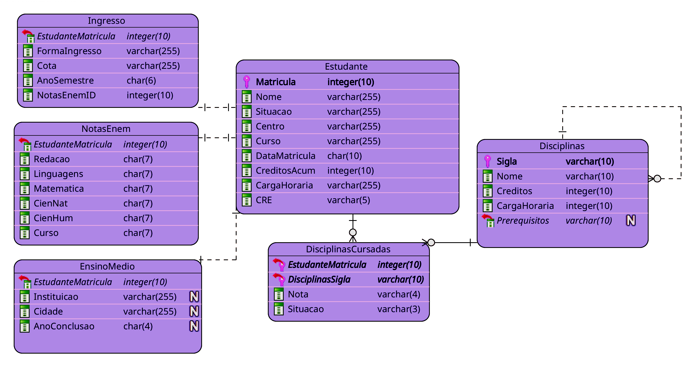

# AcaDem
A script to determine the **demand** for each **subject** of a given course at UENF from the **academic transcripts** of its students.

# Installation 
1. Install Python 3.9
2. Clone this repo
3. Run the setup script:  
    ```bash
    python setup.py
    ```

# Usage 
To use AcaDem, provide the paths to the course syllabus and the student's transcripts in the `config` file. Then, run the script in your terminal. 
The script will generate a CSV file with the code and number of students that demand each subject, as well as a SQLite database file with all the data extracted and produced. Both located at the `results` folder. 

1. Prepare a folder with students academic **transcripts** 
2. Prepare the `disciplinas_do_curso.csv` file. 
3. Optionally prepare the `disciplinas_equivalentes.csv` file.
4. Provide the filepaths to the prepared folder and files in the `config.ini` file. 
5. Run the script in your terminal:   
    ```bash
      python academ/academ.py
    ```


## Config
The [config file](config.ini) establishes the filepaths of all the files needed for the script:

<p class="codeblock-label">config.ini</p>

```ini
[paths]
PastaExtratosAcademicos = ./data/extratos_academicos
DisciplinasCursoCSV = ./data/disciplinas_do_curso.csv 
DisciplinasEquivalentesCSV = ./data/disciplinas_equivalentes.csv
ResultsFolder = ./results
```


### `PastaExtratosAcademicos`
Specifies the path to the folder with all the academic transcripts that will be used for the transcript.

### `DisciplinasCursoCSV` 
Specifies the path to the `disciplinas_do_curso.csv` file. This file is a table that lists each **subject** in the course, along with its **ID**, **name** and **prerequisites**, as the following [example](data/disciplinas_do_curso.csv):
```csv
Sigla;Nome;Prerequisitos
INF01210;Paradigma OO para Desenvolvimentode Software; INF01203,  INF01119 
INF01211;Pesquisa Operacional;MAT01208
INF01121;Testede Software;INF01210
INF01123;Interface Homem-Máquina;INF01205
LES04536;Computação e Sociedade;
INF01122;Sistemas Distribuídos;INF01115
``` 
The user can either provide this file manually, or use the script to generate it from the course syllabus. However, the script may not produce an accurate table, so it is recommended to check and edit the output if needed. 


### `DisciplinasEquivalentes`
Specifies the path to the `disciplinas_equivalentes.csv` file. This file is a table that indicates which subjects have equivalent IDs. For example, PRO0121 and MAT01201 have the same syllabus, so they are considered equivalent in both directions. This means that if a student takes one of them, they don’t need to take the other. The table shows this relationship by listing each pair of taken -> equivalent subjects in a row:
```csv
Disciplina_cursada;Disciplina_equivalente
PRO01121;MAT01201
MAT01201;PRO01121
```

### `ResultsFolder`
Specifies the path to the folder were to build the results:
   - `demanda_disciplinas_{date}.csv`: table with the number of students demanding each subject. 
   - `academ.db`: SQLite database with all the extracted data. 

# Folder Structure
```
├── README.md                        <- Program overview 
├── config.ini                       <- Configuration file
├── academ                           <- Main folder
│   ├── __init__.py                      <- Python file 
│   ├── academ.py                        <- Main code
│   ├── extratos_aggregate.py            <- Data aggregation module
│   ├── extratos_extractor.py            <- Data extraction module
│   ├── files.py                         <- File manipulation module
│   └── presentation.py                  <- Format and styling module
├── data                             <- Data folder 
│   ├── disciplinas_do_curso.csv         <- subjects from the course curriculum
│   ├── disciplinas_equivalentes.csv     <- Table of equivalences between subjects
│   └── extratos_academicos              <- Folder with the academic transcripts
├── results                          <- Results folder 
│   ├── academ.db                        <- SQLite database file
│   └── demanda_disciplinas_{date}.csv   <- Table with subjects demand
└── requirements.txt                 <- List of the required packages  
```
# Database Entity Relationship Diagram


# About
AcaDem was developed as a first step to generate information that assists coordinators and laboratory heads at Universidade Estadual do Norte Fluminense (UENF) in their decision-making process. As the university's academic system does not offer this possibility, I developed a script that extracts the necessary data from documents that coordinators and heads have access to. I tried to keep libraries at a minimum and used vanilla Python instead of Pandas, for example. It was also an interesting exploration of regular expressions and PDF data extraction.

# Examples 
[running_academ.webm](https://user-images.githubusercontent.com/57596639/230776053-be19216a-366c-461e-bffd-22d1f4a2363c.webm)
